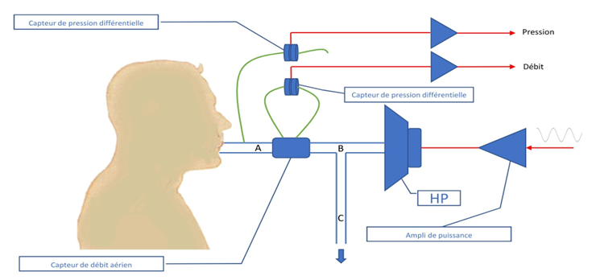
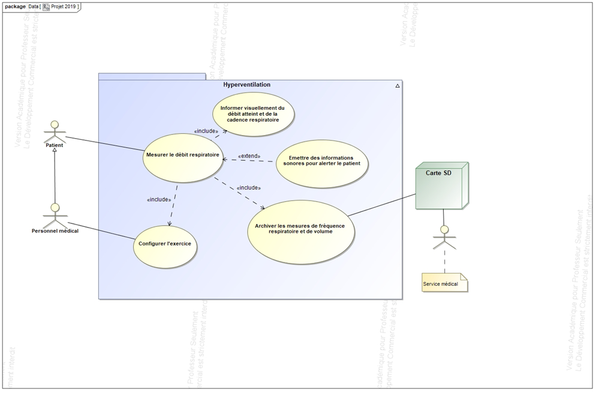

<h1>Pulmo 9 </h1>
<h2> Application en python pour Raspberry</h2>

 

 

---

Ce projet a été réalisé en 2023 dans le cadre de mon BTS au lycée Henri Loritz de Nancy. Il a pour but de réaliser un
système permettant de détecter l'asme grace à l'impédance thoraco-pulmoanire.

# Le projet

Le patient respire normalement à travers le circuit composé des tubes A, B, C et du capteur de débit aérien. Un signal
connu (par exemple une sinusoïde) est généré à l'entrée de l'amplificateur de puissance dont la sortie commande un
hautparleur. L’hautparleur ainsi excité va générer une onde de pression dans le circuit B. L'impédance mécanique du tube
C étant grande par rapport à l'impédance Patient + Tube A + Tube B + Capteur de débit aérien, l'onde produite va surtout
se propager vers le patient. Remarque : le tube C a une grande impédance mais une faible résistance mécanique pour
permettre au patient de respirer sans contrainte. L'onde de pression et le débit engendré par cette onde vont être
mesurés par deux capteurs de pression différentielle, les signaux électriques sont amplifiés et convertis pour être
traités informatiquement.

L'ensemble du système schématisé ci-dessous comprend 4 parties distinctes, une partie physique, une partie électronique
de puissance, une partie électronique amplification/numérisation, une partie informatique.

## Analyse SYSML

## Contraintes

- Le système doit communiquer avec le raspberry pi en bleutooth
- Le système doit faire des mesures de débit et de pression
- La fréquence d'échantillonage doit être 8x supérieur à la fréquence de mesure
   
- Le langage de programmation est le python
- L'arduino doit être programmé en C++
- La base de donnée est en SQL Lite

# Réalisation

## Backend

- Utilisation d'une base de donnée SQL Lite locale

- librairie [pybluez](https://github.com/pybluez/pybluez) pour la communication en bleutooth
- librairie [eelJijna2](https://github.com/python-eel/Eel) pour la communication entre le backend et le frontend et le
  serveur web
- [react](https://reactjs.org/) pour le frontend
- [vite](https://vitejs.dev/) pour la compilation du frontend
- [livechart2](https://livecharts.dev/) pour les graphiques

